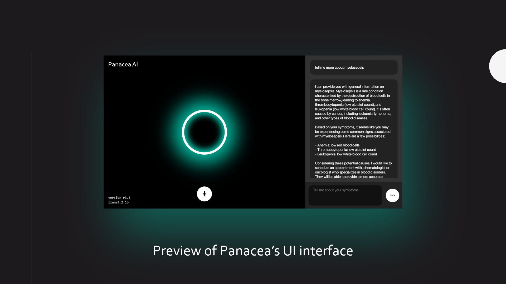

### Table of Contents
* [Overview](#overview)
* [Contributors](#contributors)
* [Technology Stack](#technology-stack)
* [How it Works](#how-it-works)
* [Our Mission](#our-mission)

----

### Overview
**Panacea AI** is an **AI-powered medical assistant** designed as a one-stop solution for providing **quick and free preliminary medical assessments**. By combining advanced **AI technology** with **user-friendly interfaces**, Panacea aims to help patients receive **timely support** while **assisting healthcare professionals** in focusing on **critical cases**.

----

### Contributors

#### Developers
* **Syed Owais** - Lead UI and Backend Developer

#### Concept and Review
* **Kaushik Behera** - Concept idea and fellow fieldtester

#### Research and Documentation
* **Argodeep Satpathy** - Medical and Development Research
* **Vardan Raj Srivastava** - Documetation Drafting for Exhibitions/Competitions

----

----

### Technology Stack

* **Backend** - **Python**, using  and  
* **UI and Frontend** - **HTML** and **CSS**, with **JavaScript** for interactivity
* **Data Flow**: **JavaScript** and **Python** work together to enable seamless data movement between the front and back end.
* **Web Audio API**: To provide an optional auditory Text-To-Speech output.

----

### How it Works

* **Symptom Input**: Users enter their symptoms in a chat interface.
* **Backend Processing**: The data is processed and synthesized with pre-defined medical context.
* **AI Analysis**: Panacea AI analyzes symptoms and generates a diagnosis or recommendation.
* **Output Delivery**: The response is sent back to the chat interface as both text and audio.

----

### Our Mission

Our mission is to democratize primary healthcare by:

* Making **diagnosis** and **consultation** accessible to everyone.
* Ensuring **quality healthcare** regardless of socioeconomic **background**.
* Supporting **medical professionals** with **comprehensive analysis** and **early detection** tools.
